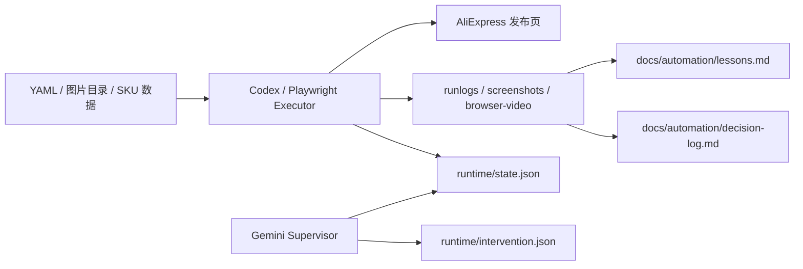

# AliExpress Listing Automation

AliExpress Seller Center listing automation built with YAML input, Playwright browser execution, schema validation, runtime evidence, and human-supervised fallback.

This repository is for `AliExpress listing automation`, `AliExpress product publish automation`, and `seller center Playwright automation`.

## Quick Answers

| Question | Answer |
|---|---|
| What is this? | A deterministic AliExpress product listing automation project. |
| What does it use? | `TypeScript`, `Playwright`, `YAML`, and schema validation. |
| What does it automate? | Product publish modules such as category, title, images, attributes, SKU flows, buyers note, detail images, and shipping. |
| Is it fully autonomous? | No. It is human-supervised and evidence-driven. |
| Where should an agent start reading? | `README.md` -> `docs/agent-index.md` -> `AGENTS.md` -> `docs/aliexpress-automation-technical-implementation.md`. |

AliExpress 发布页自动化执行器，目标不是全自动发品，而是把高重复、易出错的上架动作收敛成：

- YAML 驱动的数据输入
- Playwright 真实浏览器执行
- 状态门控与可复跑验证
- 人工监督与显式降级
- 运行证据沉淀（log / screenshot / video / lessons）

## Read This First

If you are a full-text LLM agent or a new maintainer, use this read order:

1. `README.md`
2. `docs/agent-index.md`
3. `AGENTS.md`
4. `docs/aliexpress-automation-technical-implementation.md`
5. `docs/aliexpress-automation-implementation-reference.md`
6. `docs/automation/lessons.md`
7. `docs/automation/decision-log.md`

## 当前定位

这不是一个黑盒 AI 项目。

它的核心是：

**结构化数据 + 真实页面自动化 + 失败隔离 + 长期记忆。**

Canonical identity:

- `AliExpress listing automation`
- `AliExpress Seller Center automation`
- `YAML-driven ecommerce listing automation`
- `Playwright automation against the real seller publish page`

适用场景：

- SKU 多
- 属性复杂
- 图片/详情图选择重复度高
- 错发/错配成本高
- 平台 DOM 经常漂移

## 当前进度

| 模块 | 状态 | 说明 |
|---|---|---|
| 1a 类目锁定 | 稳定 | 支持最近使用路径 |
| 1b 标题 | 稳定 | YAML 驱动 |
| 1c 商品图 | 稳定 | 默认走平台图库；真实页若上传入口或图片选择器缺失，会按当前 run 降级到 `manual_gate` |
| 1d 营销图 | 稳定 | 默认走平台图库；真实页若图片选择器缺失，会按当前 run 降级到 `manual_gate` |
| 1e 商品视频 | 单独维护 | 当前优先走媒体中心；最终成功必须以商品视频区已回写为准，暂不并入半自动主链 |
| 2 商品属性 | 稳定 | 已覆盖品牌、产地、产品类型、高关注化学品、电压、配件位置等 |
| 3 海关信息 | 人工门禁 | 真实页已漂移到海关监管属性/资质信息流，当前只检测并截图交接 |
| 4 价格/基础售卖 | 稳定 | 已通过模块 4 单测与真实页最小链路验证（1a + 4） |
| 5 SKU 与 SKU 图片 | 稳定 | 含批量填充与图片选择 |
| 6a 买家须知 | 稳定 | HTML 注入 + 提交事件 |
| 6b 详情图 | 稳定 | 支持路径推导与上传 |
| 6c APP 描述 | 人工优先 | 已进入执行计划，当前先显式转人工 |
| 7 包装与物流 | 稳定 | 已区分模块 5 与模块 7 的重量/尺寸 |
| 8 其它设置 | 人工门禁 | 自动化仅处理低风险项；欧盟责任人 / 制造商 只检测状态并截图交接，不再主动闯复杂管理入口 |

注：

- 表中“状态”表示模块成熟度和默认执行策略，不代表每轮 run 必然 `auto_ok`
- 单次运行真相只看 `runtime/state.json.module_outcomes` 和 `runtime/latest-handoff.json`
- 最近一轮半自动真实主线 `run-20260316093829-2dc580` 中，`1c/1d/1e/3/6c/8` 已按现场条件正确落成 `manual_gate`

## Source-Of-Truth Docs

| Topic | File |
|---|---|
| Retrieval-first project index | `docs/agent-index.md` |
| Runtime guardrails | `AGENTS.md` |
| Public repo safety rules | `SECURITY.md` |
| Technical architecture | `docs/aliexpress-automation-technical-implementation.md` |
| Implementation reference | `docs/aliexpress-automation-implementation-reference.md` |
| Supervisor documentation | `docs/supervisor/README.md` |
| Recovery and failure knowledge | `docs/automation/lessons.md` |
| Governance decisions and knowledge routing | `docs/automation/decision-log.md` |
| Prioritized hardening roadmap | `docs/plans/2026-03-14-prioritized-hardening-roadmap.md` |
| Reusable automation assets | `docs/automation/reusable-assets.md` |

## 核心原则

1. 先跑真实页面，再谈功能完备性。
2. 单模块优先验证，稳定后再集成。
3. 进入批量路径后，禁止回退逐个填写。
4. 声称“已修复 / 已完成”前，必须有运行命令、退出码、关键日志、可视证据。
5. 任何低 ROI、高环境耦合步骤都可以降级为人工，不强追 100% 自动化。
6. README、runbook、runtime 状态必须描述同一个项目真相；`S6 Done` 不等于“全自动完成”，必须区分自动完成与人工门禁。

## 架构概览



## 项目结构

```text
automation/
├── README.md
├── AGENTS.md
├── package.json
├── src/
│   ├── main.ts
│   ├── browser.ts
│   ├── modules.ts
│   ├── types.ts
│   ├── runtime-supervision.ts
│   ├── runtime-observability.ts
│   ├── browser-video.ts
│   └── execution-plan.ts
├── tests/
├── docs/
│   ├── automation/lessons.md
│   ├── automation/decision-log.md
│   ├── supervisor/
│   ├── aliexpress-automation-implementation-reference.md
│   └── aliexpress-automation-technical-implementation.md
├── runtime/
├── runlogs/
├── screenshots/
└── artifacts/
```

## 运行环境

- macOS
- Node.js + npm
- Google Chrome
- Playwright
- AliExpress 卖家后台账号

注意：

- `.auth/`、`.chrome-profile/`、`runtime/`、`artifacts/`、`screenshots/`、`runlogs/` 已加入 `.gitignore`
- 本地 Finder 文件选择器受 macOS TCC 影响，不应作为稳定自动化主路径

## 安装

```bash
cd /Users/aiden/Documents/Antigravity/ecommerce-ops/automation
npm install
```

## 常用命令

### 1. 登录

```bash
npm run login
```

### 2. Smoke 测试

默认验证高价值主链：模块 1 / 2 / 5。

```bash
npm run smoke -- ../products/test-module5-sku-3-position.yaml --keep-open
```

### 3. Full 测试

```bash
npm run full -- ../products/test-next-modules.yaml --auto-close
```

### 4. 单模块可视测试

这是当前推荐方式。新模块或不稳定模块，优先只测单模块，并保持浏览器前台可见。

```bash
npm run fill -- ../products/test-module1e-video.yaml --modules=1e --keep-open
```

### 5. 测试与类型检查

```bash
npm test
npm run typecheck
```

## Execution Entry Points

- CLI orchestration: `src/main.ts`
- Browser setup and page navigation: `src/browser.ts`
- Listing module logic: `src/modules.ts`
- YAML parsing and schema validation: `src/types.ts`
- Module selection and smoke/full planning: `src/execution-plan.ts`
- Runtime supervision contract: `src/runtime-supervision.ts`
- Runtime observability and HUD events: `src/runtime-observability.ts`
- Browser video evidence: `src/browser-video.ts`

## 数据输入

项目通过 YAML 驱动。测试数据位于上级目录的 `products/`。

典型字段包括：

- `category`
- `title`
- `attributes`
- `skus`
- `carousel`
- `detail_images`
- `shipping`
- `other_settings`

数据在进入浏览器前会经过 schema 校验。错误数据应在输入层 fail-fast，而不是在页面里猜。

常见检索词：

- `aliexpress automation`
- `aliexpress listing automation`
- `seller center playwright`
- `yaml product publish`
- `sku image automation`

## 运行证据

每次运行应至少留下以下一种或多种证据：

- `runlogs/*.log`
- `screenshots/*.png`
- `artifacts/browser-video/*`
- `runtime/state.json`
- `runtime/intervention.json`

HUD 和 `events.json` 已接入录屏链路，用于解释“页面为什么停住”。

如果你在排查一次失败运行，优先读：

1. `runlogs/`
2. `runtime/state.json`
3. `runtime/intervention.json`
4. `screenshots/`
5. `artifacts/browser-video/`

## 监管与诊断

当前推荐模式：

- Playwright/Codex 继续作为主执行器
- Gemini + CDP 只作为真实页面诊断层
- 不让两个执行器同时抢同一个浏览器

相关文档：

- `docs/supervisor/gemini-supervisor-agent-template.md`
- `docs/supervisor/state-intervention-schema.md`
- `docs/aliexpress-automation-technical-implementation.md`

## 已知限制

1. 视频模块当前优先走媒体中心，不把本地 Finder 上传作为稳定主链；`modal hidden` 不是成功标准，必须以商品视频区已回写为准。
2. 模块 8 采用“只检测、不闯入口”的半自动策略；欧盟责任人 / 制造商 未关联时直接截图并转人工。
3. `src/modules.ts` 仍然偏大，后续应按模块/控件类型拆分。
4. 速卖通页面会漂移；runbook 只能做参考，真实 DOM 优先。

## 推荐工作流

1. 先准备 YAML 和图片目录
2. 单模块前台可视测试
3. 连续稳定通过后再纳入集成链路
4. 每个模块稳定后，把经验写入 `docs/automation/lessons.md`
5. 长期执行边界、知识分流和治理修正写入 `docs/automation/decision-log.md`
5. 只在真正需要时，才引入 Gemini + CDP 做页面诊断

## 进一步阅读

- `docs/aliexpress-automation-implementation-reference.md`
- `docs/aliexpress-automation-technical-implementation.md`
- `docs/automation/lessons.md`
- `docs/automation/decision-log.md`
- `AliExpress_Automation_Post_Mortem.md`

## 仓库说明

当前仓库已推送到 GitHub：

- [https://github.com/SaturdayGo/ecommerce-ops-automation](https://github.com/SaturdayGo/ecommerce-ops-automation)

当前默认分支为：

- `main`
