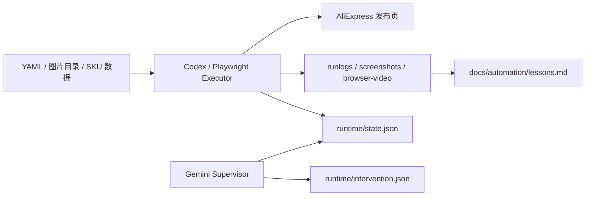

# AliExpress Listing Automation

AliExpress 发布页自动化执行器，目标不是全自动发品，而是把高重复、易出错的上架动作收敛成：

- YAML 驱动的数据输入
- Playwright 真实浏览器执行
- 状态门控与可复跑验证
- 人工监督与显式降级
- 运行证据沉淀（log / screenshot / video / lessons）

## 当前定位

这不是一个黑盒 AI 项目。

它的核心是：

**结构化数据 + 真实页面自动化 + 失败隔离 + 长期记忆。**

适用场景：

- SKU 多
- 属性复杂
- 图片/详情图选择重复度高
- 错发/错配成本高
- 平台 DOM 经常漂移

## 当前进度

| 模块 | 状态 | 说明 |
|---|---|---|
| 1a 类目锁定 | 稳定 | 支持最近使用路径 |
| 1b 标题 | 稳定 | YAML 驱动 |
| 1c 商品图 | 稳定 | 平台图库选择 |
| 1d 营销图 | 稳定 | 平台图库选择 |
| 1e 商品视频 | MVP 可用 | 当前优先走媒体中心；本地 Finder 上传不作为稳定路径 |
| 2 商品属性 | 稳定 | 已覆盖品牌、产地、产品类型、高关注化学品、电压、配件位置等 |
| 3 海关信息 | 基本可用 | 仍需按真实页面继续收口 |
| 4 价格/基础售卖 | 基本可用 | 与 SKU 流程联动 |
| 5 SKU 与 SKU 图片 | 稳定 | 含批量填充与图片选择 |
| 6a 买家须知 | 稳定 | HTML 注入 + 提交事件 |
| 6b 详情图 | 稳定 | 支持路径推导与上传 |
| 6c APP 描述 | 未完成 | 仍在 backlog |
| 7 包装与物流 | 稳定 | 已区分模块 5 与模块 7 的重量/尺寸 |
| 8 其它设置 | 人工优先 | 欧盟责任人 / 制造商 暂不作为稳定自动化链路 |

## 核心原则

1. 先跑真实页面，再谈功能完备性。
2. 单模块优先验证，稳定后再集成。
3. 进入批量路径后，禁止回退逐个填写。
4. 声称“已修复 / 已完成”前，必须有运行命令、退出码、关键日志、可视证据。
5. 任何低 ROI、高环境耦合步骤都可以降级为人工，不强追 100% 自动化。

## 架构概览



## 项目结构

```text
automation/
├── README.md
├── AGENTS.md
├── package.json
├── src/
│   ├── main.ts
│   ├── browser.ts
│   ├── modules.ts
│   ├── types.ts
│   ├── runtime-supervision.ts
│   ├── runtime-observability.ts
│   ├── browser-video.ts
│   └── execution-plan.ts
├── tests/
├── docs/
│   ├── automation/lessons.md
│   ├── supervisor/
│   ├── aliexpress-automation-implementation-reference.md
│   └── aliexpress-automation-technical-implementation.md
├── runtime/
├── runlogs/
├── screenshots/
└── artifacts/
```

## 运行环境

- macOS
- Node.js + npm
- Google Chrome
- Playwright
- AliExpress 卖家后台账号

注意：

- `.auth/`、`.chrome-profile/`、`runtime/`、`artifacts/`、`screenshots/`、`runlogs/` 已加入 `.gitignore`
- 本地 Finder 文件选择器受 macOS TCC 影响，不应作为稳定自动化主路径

## 安装

```bash
cd /Users/aiden/Documents/Antigravity/ecommerce-ops/automation
npm install
```

## 常用命令

### 1. 登录

```bash
npm run login
```

### 2. Smoke 测试

默认验证高价值主链：模块 1 / 2 / 5。

```bash
npm run smoke -- ../products/test-module5-sku-3-position.yaml --keep-open
```

### 3. Full 测试

```bash
npm run full -- ../products/test-next-modules.yaml --auto-close
```

### 4. 单模块可视测试

这是当前推荐方式。新模块或不稳定模块，优先只测单模块，并保持浏览器前台可见。

```bash
npm run fill -- ../products/test-module1e-video.yaml --modules=1e --keep-open
```

### 5. 测试与类型检查

```bash
npm test
npm run typecheck
```

## 数据输入

项目通过 YAML 驱动。测试数据位于上级目录的 `products/`。

典型字段包括：

- `category`
- `title`
- `attributes`
- `skus`
- `carousel`
- `detail_images`
- `shipping`
- `other_settings`

数据在进入浏览器前会经过 schema 校验。错误数据应在输入层 fail-fast，而不是在页面里猜。

## 运行证据

每次运行应至少留下以下一种或多种证据：

- `runlogs/*.log`
- `screenshots/*.png`
- `artifacts/browser-video/*`
- `runtime/state.json`
- `runtime/intervention.json`

HUD 和 `events.json` 已接入录屏链路，用于解释“页面为什么停住”。

## 监管与诊断

当前推荐模式：

- Playwright/Codex 继续作为主执行器
- Gemini + CDP 只作为真实页面诊断层
- 不让两个执行器同时抢同一个浏览器

相关文档：

- `docs/supervisor/gemini-supervisor-agent-template.md`
- `docs/supervisor/state-intervention-schema.md`
- `docs/aliexpress-automation-technical-implementation.md`

## 已知限制

1. 视频模块当前优先走媒体中心，不把本地 Finder 上传作为稳定主链。
2. 模块 8 仍建议人工处理。
3. `src/modules.ts` 仍然偏大，后续应按模块/控件类型拆分。
4. 速卖通页面会漂移；runbook 只能做参考，真实 DOM 优先。

## 推荐工作流

1. 先准备 YAML 和图片目录
2. 单模块前台可视测试
3. 连续稳定通过后再纳入集成链路
4. 每个模块稳定后，把经验写入 `docs/automation/lessons.md`
5. 只在真正需要时，才引入 Gemini + CDP 做页面诊断

## 进一步阅读

- `docs/aliexpress-automation-implementation-reference.md`
- `docs/aliexpress-automation-technical-implementation.md`
- `docs/automation/lessons.md`
- `AliExpress_Automation_Post_Mortem.md`

## 仓库说明

当前仓库已推送到 GitHub：

- [https://github.com/SaturdayGo/ecommerce-ops-automation](https://github.com/SaturdayGo/ecommerce-ops-automation)

当前默认分支为：

- `codex/init-github-upload`

后续如需切换为 `main`，建议在确认 README、目录结构和基础文档稳定后再做。
