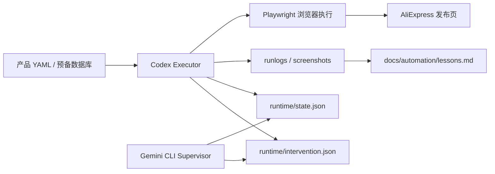

# AliExpress 自动化上架实现文档

## 文档目的

这份文档不是“项目汇报”，而是给一个对自动化感兴趣、准备自己复用的人看的实现参考。

目标只有三个：

1. 解释这套自动化为什么值得做
2. 解释它是怎么实现的
3. 解释如果要复用到别的平台，应该先准备什么数据

如果需要偏开发者视角的实现细节，直接看：

- `docs/aliexpress-automation-technical-implementation.md`

这套方案最适合的场景不是“电商全自动”，而是：

- SKU 多
- 属性多
- 页面操作重复
- 错发成本高
- 平台 DOM 经常漂移

AliExpress 只是第一落点，底层方法论是通用的。

---

## 一句话定义

这不是一个“黑盒 AI 帮你发品”的项目。

它本质上是：

**YAML 驱动的浏览器自动化执行器 + 状态门控 + 人工兜底 + 可复跑验证 + 运行时监管接口。**

核心思想不是追求 100% 自动点击，而是：

- 让稳定模块自动执行
- 让脆弱模块显式人工介入
- 让失败不炸全链路
- 让每次运行都产出可复用经验

---

## 为什么值得做

### 商业侧原因

手工上架最大的浪费不是点击本身，而是：

- 重复录入
- 反复对照图和价格
- SKU 图片反复选目录
- 页面出错后整单重来
- 同类产品第二次还要从零再铺一次

如果一个品有 3-8 个 SKU，页面还带类目、属性、海关、物流、图片、详情图、欧盟责任人、制造商这些模块，人工铺一条 listing 的体力成本会很夸张。

如果这些动作没有沉淀成结构化数据，第二个平台、第二次补货、第二次改标题时，还要再做一遍同样的苦活。

### 工程侧原因

AliExpress 发布页的真正难点不是“逻辑复杂”，而是：

- 选择器漂移
- 组件类型不一致
- portal / 弹窗 / 浮层行为古怪
- 局部成功和稳态成功不是一回事
- 用户或平台打断后容易整链报废

所以这类项目不能按“普通表单自动化”思路写。

必须按下面这条原则来：

> 先跑真实页面，再谈功能完备。

---

## 总体架构



### 角色拆分

| 角色 | 职责 |
|---|---|
| 结构化数据层 | 提供 YAML / 图片目录 / SKU 信息 |
| 执行器 | 打开真实浏览器，按模块填表 |
| 监管器 | 读取状态与证据，判断是否应介入 |
| 人工 | 登录、最终检查、低 ROI 模块收尾 |

这套拆分的价值在于：

- 浏览器执行失败时，不等于数据丢失
- 监管逻辑和点击逻辑可以分离
- 未来要迁移到 Taobao/PDD，很多“数据准备层”和“监管层”都能复用

---

## 目录结构

项目根目录：

- [/Users/aiden/Documents/Antigravity/ecommerce-ops/automation](/Users/aiden/Documents/Antigravity/ecommerce-ops/automation)

核心目录：

| 路径 | 作用 |
|---|---|
| [src/main.ts](/Users/aiden/Documents/Antigravity/ecommerce-ops/automation/src/main.ts) | 执行入口，控制模块顺序和状态写入 |
| [src/modules.ts](/Users/aiden/Documents/Antigravity/ecommerce-ops/automation/src/modules.ts) | 具体页面自动化逻辑 |
| [src/browser.ts](/Users/aiden/Documents/Antigravity/ecommerce-ops/automation/src/browser.ts) | 浏览器启动、登录、截图、人工确认 |
| [src/types.ts](/Users/aiden/Documents/Antigravity/ecommerce-ops/automation/src/types.ts) | YAML 结构与校验 |
| [src/runtime-supervision.ts](/Users/aiden/Documents/Antigravity/ecommerce-ops/automation/src/runtime-supervision.ts) | 运行时状态/干预读写 |
| [products/](/Users/aiden/Documents/Antigravity/ecommerce-ops/products) | 测试和真实产品 YAML |
| [runlogs/](/Users/aiden/Documents/Antigravity/ecommerce-ops/automation/runlogs) | 每次运行的日志 |
| [screenshots/](/Users/aiden/Documents/Antigravity/ecommerce-ops/automation/screenshots) | 每次运行的截图证据 |
| [docs/automation/lessons.md](/Users/aiden/Documents/Antigravity/ecommerce-ops/automation/docs/automation/lessons.md) | 已验证经验沉淀 |
| [docs/supervisor/](/Users/aiden/Documents/Antigravity/ecommerce-ops/automation/docs/supervisor) | Gemini 监管说明与文件契约 |

---

## 数据层：为什么必须先铺“预备信息数据库”

你朋友原话里最有价值的一句是：

> 先按照自动化的需求铺好预备信息数据库。

这是对的。

### 为什么先做数据库，而不是先写点击脚本

因为电商发布页里最贵的不是点击，而是“信息重组”。

真正要复用的不是：

- 点击哪个按钮
- 往哪一格填什么词

真正要复用的是：

- 产品标题
- 类目映射
- 属性映射
- SKU 名称和图片对应关系
- 价格/货值/库存
- 重量/尺寸
- 详情图目录结构

如果这些信息仍然散落在聊天记录、图片文件夹、表格、脑子里，自动化的 ROI 会很差。

### 推荐最小数据结构

```yaml
category: "汽车及零配件 > 车灯 > 信号灯总成 > 尾灯总成"
title: "fit for Toyota sienna taillight assembly"
attributes:
  brand: "NONE(NONE)"
  origin: "中国大陆(Origin)(Mainland China)"
  product_type: "尾灯总成(Tail Light Assembly)"
  hazardous_chemical: "无(None)"
  material: "ABS"
  voltage: "12伏(12 V)"
  accessory_position: "右+左(Right & left)"
skus:
  - name: "Smoky Black"
    image: "FAMILY SUV/TOYOTA SIENNA/SKUa.jpg"
    price_cny: 1299
    declared_value_cny: 999
    stock: 20
```

### 这层数据以后怎么复用

如果以后不是 AliExpress，而是 Taobao/PDD：

- 类目名称会变
- 页面控件会变
- 监管规则可能会变

但下面这些大概率不变：

- 你的产品基础数据
- SKU 和图片的绑定关系
- 价格/货值/库存逻辑
- 重量和尺寸
- 车型适配信息

所以先铺“预备数据库”是对的。那是资产。点击脚本只是消费这个资产的执行器。

---

## 执行流

当前执行主链大致是：

```text
读取 YAML
-> 打开发布页
-> 登录检查
-> 填标题
-> 锁类目
-> 上传图片
-> 填商品属性
-> 填 SKU 信息
-> 选 SKU 图片
-> 填物流/其他设置
-> 截图
-> 人工确认
```

在运行时监管接入后，执行流变成：

```text
读取 YAML
-> 写 runtime/state.json
-> 执行下一个关键状态
-> 读取 runtime/intervention.json
-> 决定继续 / 记录 / 停机
```

这意味着后面如果要接 Gemini CLI，不需要 Gemini 操作浏览器，只需要它看状态和证据就够了。

---

## 为什么不用“纯全自动”

因为平台不是为自动化稳定性设计的。

AliExpress 发布页里有几类东西非常不适合硬上全自动：

### 1. 低 ROI、高脆弱性操作

比如：

- 详情图排序
- 某些拖拽上传
- 某些 portal 弹层里的浮动选择框

这种地方不是不能做，而是投入产出比很差。

### 2. 平台策略不稳定的区域

比如：

- 欧盟责任人
- 制造商关联
- 某些类目下高关注化学品弹窗

这些页面很可能变动，而且一旦出错，回滚成本高。

### 3. 需要最终人审的环节

比如：

- 发布按钮
- 最终图片顺序确认
- 商品文案最终检查

所以当前策略是：

> 自动化做 80% 的稳定搬运，人工做最后 20% 的高风险确认。

---

## 最关键的实现策略

### 1. 状态门控，而不是一口气跑到底

当前项目不是“从头点到尾”的脚本。

它按状态推进：

- `S0 Preflight`
- `S1 LoginReady`
- `S2 CategoryLocked`
- `S3 Module2Stable`
- `S4 SkuImagesDone`
- `S5 Verify`
- `S6 Done`

价值：

- 出错时知道断在哪
- 能把失败定位到模块，不是整条链黑盒
- 能让监管器只在关键时刻介入

### 2. 先真实 DOM，后抽象函数

这个项目最大的教训之一是：

> 代码逻辑通常不是核心风险，选择器是否命中真实 DOM 才是。

所以每个模块稳定之前，都要先在真实页面跑通，再总结抽象。

### 3. 允许人工降级，但不能整链报废

比如 SKU 图片图库：

- 第一次弹窗失败 → 立即重开一次
- 如果仍失败 → 先继续后续 SKU
- 最后再回补失败的 SKU

这比“报错即停”更适合发布页这种半结构化页面。

### 4. 经验必须沉淀，不然永远在重复造轮子

项目里专门维护：

- [lessons.md](/Users/aiden/Documents/Antigravity/ecommerce-ops/automation/docs/automation/lessons.md)

每个稳定模块都记录：

- failure signature
- working selector or action
- rollback condition

这一步不是附属品，是核心资产。

---

## 监管层：为什么要接 Gemini CLI，而不是让两个执行器抢页面

最容易犯的错是：

- Codex 控浏览器
- Gemini 也控浏览器

这会导致两个问题：

1. 焦点互抢
2. 根因判断失真

所以当前设计里：

- Codex = 执行器
- Gemini = 监管器

Gemini 读这些文件：

- [AGENTS.md](/Users/aiden/Documents/Antigravity/ecommerce-ops/automation/AGENTS.md)
- [GEMINI.md](/Users/aiden/Documents/Antigravity/ecommerce-ops/automation/.gemini/GEMINI.md)
- [state.json](/Users/aiden/Documents/Antigravity/ecommerce-ops/automation/runtime/state.json)
- [intervention.json](/Users/aiden/Documents/Antigravity/ecommerce-ops/automation/runtime/intervention.json)
- [runlogs/](/Users/aiden/Documents/Antigravity/ecommerce-ops/automation/runlogs)
- [screenshots/](/Users/aiden/Documents/Antigravity/ecommerce-ops/automation/screenshots)

Gemini 输出：

- 继续观察
- 给出纠偏建议
- 要求人工停止

但它不直接点页面。

这是更稳的设计。

---

## 当前哪些模块已经打通

按当前代码和验证状态，项目大致分成三类：

### 已经有较稳定链路

- 标题
- 类目
- 主图/营销图的基础链路
- 商品属性中的多个关键字段
- 多 SKU 的颜色/名称/图片
- 批量填充共享字段
- 模块 7 物流区
- 运行时状态写入

### 部分稳定、仍需继续打磨

- 模块 2 某些真实页下的偶发大面积转人工
- Gemini 监管的“自动消费干预”能力
- 某些 portal 下拉的稳态确认

### 仍然建议人工处理

- 详情图排序
- 模块 8 某些低 ROI 配置项
- 最终发布按钮

---

## 这套方法如果迁移到 Taobao / 拼多多，应该怎么做

不是先移植点击脚本。

正确顺序是：

### 第一层：先做平台无关的数据层

先把这些东西整理成数据库或结构化文件：

- 产品基础信息
- 类目映射
- 属性映射
- SKU 维度
- 图片目录映射
- 物流维度

### 第二层：再做平台映射层

每个平台只需要补：

- 页面模块顺序
- 属性字段与平台控件的对应关系
- 图片上传入口和目录树逻辑
- 物流与发布规则

### 第三层：最后才是执行器

执行器只是把“平台映射层”翻译成点击动作。

也就是说：

> 同一套预备数据库，可以喂给多个平台执行器。

这才叫资产复用。

---

## 朋友如果要自己做，最小起步建议

不要一开始就做“全自动电商发布系统”。

最小可行起步是：

### 阶段 1：数据先行

准备一个统一表，至少包含：

- 标题
- 类目
- 主图目录
- 属性映射
- SKU 名称/价格/库存/图片
- 重量/尺寸

### 阶段 2：只自动化最稳定的 1-2 个模块

例如：

- 标题
- SKU 图片选择

先在真实页面上跑通。

### 阶段 3：加入状态门控和截图

每个关键状态写日志、截图、记录当前模块。

### 阶段 4：再加监管器

等执行器本身有了明确状态以后，再接 Gemini CLI 这种监管器。

不要本末倒置。

---

## 这个项目最值钱的部分，不在脚本本身

真正值钱的是四个东西：

1. 你整理过的结构化产品数据
2. 你踩过坑后的 lessons 库
3. 你把模块拆成状态机的方式
4. 你明确划出的“自动 / 人工”边界

脚本会变，平台会变，模型会变。

但这四样东西一旦立住，后面无论是 AliExpress、Taobao、拼多多，还是别的后台，都会快很多。

---

## 给你朋友的直白结论

如果你只是想“省点击时间”，这项目不一定值。

如果你有下面这些问题，它就值：

- SKU 多
- 人工重复操作多
- 页面经常出错
- 一旦填错，代价很高
- 你希望把每次上架沉淀成长期可复用的数据资产

那它就不是一个脚本项目，而是一个**运营执行系统的雏形**。

---

## 延伸阅读

- [Automation Lessons](/Users/aiden/Documents/Antigravity/ecommerce-ops/automation/docs/automation/lessons.md)
- [Gemini Supervisor Agent Template](/Users/aiden/Documents/Antigravity/ecommerce-ops/automation/docs/supervisor/gemini-supervisor-agent-template.md)
- [State And Intervention Schema](/Users/aiden/Documents/Antigravity/ecommerce-ops/automation/docs/supervisor/state-intervention-schema.md)
- [Gemini Runtime Integration Plan](/Users/aiden/Documents/Antigravity/ecommerce-ops/automation/docs/plans/2026-03-06-gemini-runtime-integration.md)
