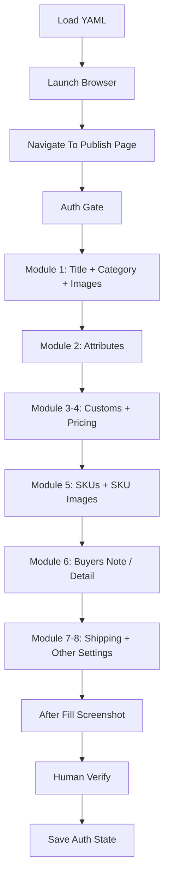

# AliExpress 自动化上架：技术实现版

## 1. 文档定位

这份文档给开发者，不给业务方。

目标只有四个：

1. 快速看懂当前代码是怎么组织的
2. 明确状态机、模块边界、人工边界
3. 找到关键入口，不必在 `src/modules.ts` 里盲翻
4. 为二开、迁移、接监管器提供准确骨架

它描述的是**当前真实实现**，不是理想蓝图。

---

## 2. 项目根目录

项目根目录：

- `/Users/aiden/Documents/Antigravity/ecommerce-ops/automation`

核心文件：

| 路径 | 作用 |
|---|---|
| `src/main.ts` | 执行入口，负责参数解析、状态推进、模块顺序、错误出口 |
| `src/browser.ts` | 浏览器生命周期、登录、发布页导航、截图、人工确认 |
| `src/modules.ts` | 具体模块自动化实现与大部分 DOM 适配逻辑 |
| `src/types.ts` | YAML schema、类型定义、数据加载 |
| `src/runtime-supervision.ts` | `runtime/state.json` / `runtime/intervention.json` 契约与读写 |
| `src/safe-click.ts` | click 兜底与可见性保护 |
| `tests/*.test.ts` | 回归测试，覆盖导航、类目、模块 2、模块 7、运行时监管、输入安全 |
| `products/*.yaml` | 测试数据与真实产品数据 |
| `runlogs/*.log` | 每次真实执行的日志证据 |
| `screenshots/*.png` | 每次真实执行的截图证据 |
| `docs/automation/lessons.md` | 已验证问题/解法沉淀 |
| `.gemini/GEMINI.md` | Gemini CLI 项目上下文 |
| `runtime/state.json` | 执行器写出的当前状态 |
| `runtime/intervention.json` | 监管器写回的干预决策 |

最重要的现实：

- 这个项目不是 git repo
- 没有分层到多个页面对象文件
- 目前主要复杂度集中在 `src/modules.ts`

---

## 3. 数据模型

数据入口是 YAML，载入点在 `src/types.ts`。

关键函数：

- `loadProductData(yamlPath)`
- `parseProductData(raw, source)`

关键事实：

1. 这里已经不是“弱类型读 YAML”。它有 Zod schema。
2. schema 错误会直接 fail-fast，不进入浏览器。
3. 当前字段设计以模块划分，不以平台划分。

核心接口：

```ts
interface ProductData {
  category: string;
  title: string;
  carousel: string[];
  attributes: Attributes;
  customs: { hs_code: string };
  pricing_settings: { min_unit: string; sell_by: string };
  skus: SKU[];
  shipping: { ... };
  other_settings: { ... };
}
```

这层的意义不是类型优雅，而是：

- 把错数据拦在浏览器外
- 让“平台点击问题”和“数据错误问题”彻底分离

---

## 4. 顶层执行流

入口：`src/main.ts`

执行顺序不是自由组合，而是固定主链：



### smoke / full 模式

`main.ts` 里有两种运行模式：

| 模式 | 实际执行 |
|---|---|
| `--smoke` | 模块 1 / 2 / 5 |
| 默认 full | 模块 1-8 |

`smoke` 的作用不是“跑快一点”，而是：

- 先验证最容易爆炸的真实 DOM 路径
- 不把低 ROI 模块混进调试噪声里

---

## 5. 状态机

当前运行时状态机不是文档概念，是真写到 `runtime/state.json` 的。

状态定义在 `main.ts` 的 `checkpoint()` 调用链里。

### 当前状态序列

| Code | Name | 通过条件 | 代码位置 |
|---|---|---|---|
| `S0` | `Preflight` | YAML 成功加载并通过 schema | `main.ts` 载入数据后 |
| `S1` | `LoginReady` | 已进入发布页，登录门通过 | `navigateToPublishPage()` 之后 |
| `S2` | `CategoryLocked` | 类目锁定完成 | `fillCategory()` 之后 |
| `S3` | `Module2Stable` | `fillAttributes()` 返回 | 模块 2 之后 |
| `S4` | `SkuImagesDone` | `fillSKUs()` + `fillSKUImages()` 返回 | 模块 5 之后 |
| `S5` | `Verify` | 已截 `after_fill`，等待人工检查 | 人工确认前 |
| `S6` | `Done` | 登录态保存完成 | 最终收尾 |

### 状态机的真实作用

不是“好看”。它有三个硬价值：

1. Gemini 监管器知道当前卡在哪
2. 出错时能知道失败发生在主链哪个段
3. 后续可以把“从中断点恢复”做成工程能力

### 当前状态机的限制

它现在是**检查点状态机**，不是**细粒度动作状态机**。

也就是说：

- 它知道你卡在模块 2
- 但还不知道你卡在 `产品类型`、`电压` 还是 `配件位置`

如果后续要进一步升级，可在模块内部补更细的 `field-level checkpoint`。

---

## 6. 浏览器层

入口：`src/browser.ts`

### 6.1 关键职责

| 函数 | 作用 |
|---|---|
| `launchBrowser()` | 启动系统 Chrome 持久上下文 |
| `navigateToPublishPage()` | 打开发布页并确保落到稳定前端 |
| `navigateToLoginPage()` | 强制打开卖家登录页 |
| `waitForSellerLogin()` | 人工登录轮询 |
| `saveAuth()` | 保存 `.auth/storage-state.json` |
| `screenshot()` | 运行证据截图 |
| `waitForHumanConfirmation()` | 人工门控 |

### 6.2 当前最重要的导航策略

发布页现在有两套前端：

- `m_apps/product-publish-v2/pop`
- `ait/cn_pop/item_product/product_publish`

项目中已经验证过：

- `m_apps` 壳页会导致模块 2 DOM 漂移，出现“产品类型卡住 / 电压乱跳 / 整段转人工”
- `ait/cn_pop` 是当前稳定前端

所以 `navigateToPublishPage()` 的真实策略是：

1. 先打 `m_apps` 入口
2. 如果已经在 `ait/cn_pop`，直接放行
3. 如果还停在 `m_apps`，即使表单已渲染，也强制跳到 `ait/cn_pop`

这不是美观问题，是整个模块 2 是否稳定的前门。

---

## 7. 模块边界

所有模块当前都在 `src/modules.ts`，但逻辑上已经分段。

### 模块 1：基本信息

入口：

- `fillTitle(page, data)`
- `fillCategory(page, data)`
- `fillCarouselImages(page, data)`
- `fillMarketingImages(page, data)`

职责：

- 标题
- 类目
- 商品图 / 营销图

边界：

- 不负责视频
- 类目锁定完成后才进入模块 2
- 图片失败不应该污染类目状态

### 模块 2：商品属性

入口：

- `fillAttributes(page, data)`

这是当前最脆弱、也是最值钱的 DOM 适配层。

内部实际拆成三类字段：

| 类型 | 例子 | 当前处理 |
|---|---|---|
| 文本输入 | `材质`、`适用车型` | `fillBulkInputByLabel()` |
| 下拉选择 | `品牌`、`产地`、`电压`、`配件位置` | `selectDropdownWithOptionHintsByLabel()` |
| 自动补全 | `产品类型` | `selectAutocompleteWithOptionHintsByLabel()` |
| 弹窗型 | `高关注化学品` | `selectHazardousChemicalByModal()` |

关键现实：

- 模块 2 不是“一个表单函数”
- 它本质上是“字段类型分派器 + DOM 变体适配器”

### 模块 3-4：海关 + 价格设置

入口：

- `fillCustoms(page, data)`
- `fillPricingSettings(page, data)`

当前复杂度较低，不是主要阻塞点。

### 模块 5：SKU

入口：

- `fillSKUs(page, data)`
- `fillSKUImages(page, data)`

模块 5 内部又分成两条链：

1. 销售属性 / 名称 / 价格库存等数值
2. SKU 图片库选择

这里的关键策略：

- **进入批量填充后，禁止回退逐个填写**
- 批量只填共享字段：`库存 / 重量 / 长宽高`
- `价格 / 货值` 继续逐行写
- `是否原箱 / 物流属性` 当前仍保留人工边界

### 模块 6：详情描述

入口：

- `fillBuyersNote(page, data)`

现状：

- 买家须知已有自动化路径
- 详情图排序仍建议人工
- APP 描述不是主链优先级

### 模块 7：包装与物流

入口：

- `fillShipping(page, data)`

风险点：

- 模块 7 的 `总重量/长宽高` 和模块 5 的行内字段同名
- 如果 scope 取错，会把物流信息写进 SKU 行

当前稳定策略：

- 先切 `包装与物流` tab
- 用 `长/宽/高` 三联输入反推正确容器
- 只在该容器内填 `总重量` 和尺寸

### 模块 8：其它设置

入口：

- `fillOtherSettings(page, data)`

现状：

- `欧盟责任人 / 制造商` 仍偏人工
- 这里不是点击难，而是 ROI 低、入口不稳定

---

## 8. 模块 2 的核心实现骨架

如果只看一个模块，应该先看模块 2。

### 8.1 入口函数

`fillAttributes(page, data)`

它做的不是“直接依次点字段”，而是：

1. 先建立 `scope`
2. 计算各字段的 hint 集合
3. 按字段类型分派到不同 helper
4. 记录 `hitCount / attemptedCount / unresolvedFields`
5. 打印命中结果

### 8.2 关键 helper

| 函数 | 作用 |
|---|---|
| `pickMostSpecificLabelNode()` | 找最贴近目标字段的 label 节点 |
| `findNearestFieldContainer()` | 从 label 向上找最近的字段容器 |
| `fillBulkInputByLabel()` | 文本输入型字段 |
| `selectDropdownWithOptionHintsByLabel()` | 下拉选择型字段 |
| `selectAutocompleteWithOptionHintsByLabel()` | 自动补全型字段 |
| `selectHazardousChemicalByModal()` | 指标选择弹窗 |

### 8.3 这层为什么难

因为 AliExpress 的“下拉”不是一个控件：

- 有的值写在 trigger 文本里
- 有的值写在内部 input 里
- 有的值写在行内 `selected-item`
- 有的值通过 portal 浮层提交

所以代码里现在要做的不是“点了选项就算成功”，而是：

- 查 trigger
- 查 input value
- 查 title / aria
- 查行内 selected 节点

这就是为什么模块 2 会占掉大部分 DOM 适配复杂度。

---

## 9. 模块 5 的核心实现骨架

模块 5 是另一条核心链。

### 9.1 先填颜色/名称，再进数值

顺序不是随意的，当前稳定顺序是：

```text
光线颜色
-> 自定义名称
-> SKU 图片上传
-> SKU 数值 / 批量填充
```

### 9.2 图片库策略

`fillSKUImages()` 的真实难点不在上传，而在目录树和弹窗恢复。

当前策略：

- 打开图库
- 进入 `商品发布 -> TailLights -> FAMILY SUV -> TOYOTA SIENNA`
- 选目标图片
- 如果中断/取消/超时：立刻重开一次
- 若仍失败：继续后续 SKU，模块尾回补

这是当前项目里最明确的一条“继续执行 + 人工收尾”策略实现。

### 9.3 批量填充语义

当前已经修正为：

- 批量行不再写 `价格/货值`
- 只写共享字段

这是一个重要的语义边界，不是单纯 selector 优化。

---

## 10. 运行时监管接口

监管层在：

- `src/runtime-supervision.ts`
- `runtime/state.json`
- `runtime/intervention.json`

### 10.1 state.json

执行器每个关键 checkpoint 都会写一个状态快照，内容包括：

- 当前状态码
- 当前模块
- 目标字段
- 上一步动作
- 下一步预期动作
- gate 结果
- 日志/截图证据路径

### 10.2 intervention.json

监管器可以写回：

- `observe`
- `advise`
- `intervene`
- `escalate`
- `manual_stop`

当前执行器只会对这两类硬停：

- `escalate`
- `manual_stop`

也就是说，Gemini 现在能监管，但不会和 Playwright 抢浏览器控制权。

这是故意设计的。

---

## 11. 回归测试策略

当前测试不是端到端页面全模拟，而是“高风险行为回归测试”。

现有重点测试：

| 测试文件 | 保护什么 |
|---|---|
| `tests/browser-navigation.test.ts` | 导航必须强制落到 legacy 发布页 |
| `tests/category-recent-button.test.ts` | 类目前门的 loading shell 恢复 |
| `tests/module2-dropdowns.test.ts` | 模块 2 dropdown 基本命中 |
| `tests/module2-structured-fields.test.ts` | 产品类型/电压/配件位置/高关注化学品等复杂字段 |
| `tests/module7-shipping.test.ts` | 模块 7 不得污染模块 5 |
| `tests/p0-safety.test.ts` | YAML 驱动安全边界 |
| `tests/runtime-supervision.test.ts` | 运行时状态/干预契约 |

这套测试的目标不是证明“AliExpress 永远不会改 DOM”。

目标是：

- 只要你刚修过的 bug 又回来了，测试能第一时间叫停

---

## 12. 当前人工边界

这套项目不是追求 100% 自动化，而是追求**正确的自动化边界**。

当前仍建议人工的部分：

| 模块 | 人工边界 | 原因 |
|---|---|---|
| 登录 | 人工登录 | 平台认证/风控 |
| 详情图排序 | 人工 | 平台上传顺序不稳定，自动拖拽 ROI 很差 |
| 模块 8 欧盟责任人 / 制造商 | 多数场景人工 | 入口不稳定，业务价值低于主链稳定性 |
| 最终发布按钮 | 人工 | 防止错误内容直接发出 |

这不是“不够自动化”，而是“只把值得自动化的部分自动化”。

---

## 13. 已验证的关键架构决策

### 决策 1：真实页优先

不是先补功能，再去看页面。顺序相反。

### 决策 2：前门 gate 比字段补丁更值钱

最近一次明确案例：

- 不是 `产品类型` 控件坏了
- 是入口偶发停留在 `m_apps` 新前端
- 导航层修正后，整段模块 2 恢复稳定

### 决策 3：共享字段与 per-SKU 字段必须分开

批量填充不能偷写价格/货值。

### 决策 4：监管器只监管，不共控浏览器

Gemini/Codex 双执行器抢页面，只会制造竞争条件。

---

## 14. 开发者接手建议

如果新开发者第一次接手，不要一上来读完整 `modules.ts`。

正确顺序：

1. 先读 `src/main.ts`
   - 看主链和状态机
2. 再读 `src/browser.ts`
   - 看发布页入口和登录门
3. 再读 `src/types.ts`
   - 看 YAML 数据模型
4. 再读 `src/runtime-supervision.ts`
   - 看监管接口
5. 最后按问题进入 `src/modules.ts`
   - 哪个模块有问题，只读那个段和对应测试

如果遇到“字段看起来选中了，但最后页面没留下来”的问题，优先检查三件事：

1. 这是 dropdown、autocomplete、还是 modal
2. 提交值写在 trigger、input，还是 row-level selected node
3. 当前是不是落在了错误前端分支（`m_apps` vs `ait/cn_pop`）

---

## 15. 如果迁移到别的平台

别先搬点击逻辑，先搬这三层：

1. 数据层
   - YAML / SKU / 图片目录 / 价格库存结构
2. 状态机层
   - `S0 -> S6` 这种关键 checkpoint
3. lessons 层
   - 已经验证过的失败签名与回退条件

真正平台相关的，是下面这层：

- DOM 适配器
- selector 体系
- portal / modal 行为

所以迁移应该理解成：

```text
复用数据层 + 复用状态机 + 重写平台适配层
```

而不是把 Playwright 脚本整段复制过去。

---

## 16. 当前最值得继续投资的方向

按 ROI 排序：

1. 把 `src/modules.ts` 再拆层
   - 字段类型适配器
   - 模块 orchestration
   - 图片库导航
2. 给模块 2 增加更细粒度 field-level checkpoint
3. 给模块 5 的图片恢复链路增加模块尾回补报告
4. 给 Gemini 监管器增加更细的“状态观测”，但仍不共控浏览器

不值得优先做的：

- 详情图自动拖拽排序
- 强推模块 8 全自动
- 追求 headless 稳定执行

---

## 17. 一句话总结

这套系统不是“AI 自动发布”。

它的工程实质是：

**结构化产品数据 + 有状态浏览器执行器 + 脆弱控件适配层 + 明确人工边界 + 可复跑证据链。**

真正可迁移、可复利的，不是点击本身，而是这五层骨架。
